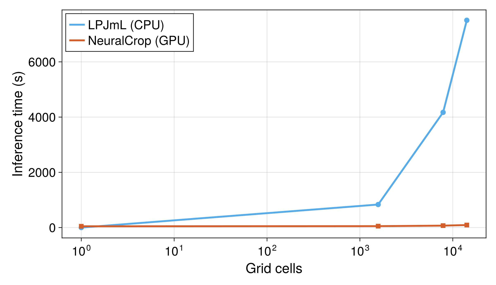

<!-- Title -->
<h1 align="center">
NeuralCrop.jl
</h1>

<!-- description -->
<p align="center">
  <strong> 🧑‍🌾 💧 ☀️ 🌾 🚀 Fast and flexible Julia framework for hybrid crop modelling across scales. </strong>
</p>

<p align="center">
  <a href="https://yunan-l.github.io/NeuralCrop.jl/stable/">
    
  </a>
  <a href="https://github.com/yunan-l/NeuralCrop.jl/actions">
    
  </a>
  <a href="https://doi.org/10.48550/arXiv.2512.20177">
    
  </a>

</p>

NeuralCrop is a differentiable hybrid global gridded crop model (GGCM) that combines the strengths of the state-of-the-art GGCM [LPJmL](https://doi.org/10.5194/gmd-11-1343-2018) with machine learning approaches. By implementing process-based components in a differentiable form for seamless integration with machine learning methods, NeuralCrop enables end-to-end 'online training', with machine learning components optimized in tandem with the physical model dynamics. NeuralCrop is a flexible Julia framework supporting both purely process-based and hybrid simulations across CPUs and GPUs. More details are available in our preprint paper: [https://arxiv.org/abs/2512.20177](https://arxiv.org/abs/2512.20177)


## Installation

NeuralCrop is still under development to make it more user-friendly and not yet registered as a Julia package. To use it, you can still install the package from the repository via the package manager (type `]` in your REPL):
```
pkg> add https://github.com/yunan-l/NeuralCrop.jl.git
```

or clone the repository to your machine. 

Then, in the Julia REPL, activate the project and instantiate it to replicate our exact package versions:

```julia
pkg> activate(".")
pkg> instantiate()
```

This approach ensures you use the exact versions of all dependencies as specified in `Manifest.toml`, avoiding potential package version conflicts.

We recommend running NeuralCrop on Julia version 1.10.x.

## Example use

NeuralCrop does not provide the climate and management data required to drive the model, as these datasets originate from third-party sources. You can obtain the necessary input data from the [ISIMIP data repository](https://data.isimip.org/) (Inter-Sectoral Impact Model Intercomparison Project), and please cite the ISIMIP data appropriately when using it.

For a quick start, we provide a simplified demo in the examples/ directory, including 20-year forcing data (2000-2019) covering 10 grid cells. You can run the model on Jupyter Notebook 🚀.

## Usage

We warmly welcome the use of NeuralCrop.jl for academic research and educational purposes 🎓. You are encouraged to copy, modify, and build upon our code to advance scientific understanding of agricultural systems. 

However, please note that this project is licensed under the Creative Commons Attribution-NonCommercial 4.0 International (CC BY-NC 4.0) [license](LICENSE). Any commercial application or redistribution for profit requires explicit prior authorization.

If you are interested in contributing or have any questions, please feel free to contact <yunan.lin@tum.de>.


## Performance benchmarks

We compare the inference time between GPU-accelerated NeuralCrop and CPU-based LPJmL by running them on a $0.5^\circ \times 0.5^\circ$ spatial resolution with daily time steps over a 20-year simulation period (7300 days) at different grid cells. NeuralCrop achieves approximately 100x speedup 🚀🚀🚀.

<p align="left">
  
</p>


## Acknowledgements

NeuralCrop.jl is a research project developed with the support by the [Earth System Modeling group ](https://www.asg.ed.tum.de/esm/home/) at the Technical University of Munich (TUM) and [FutureLab on Artificial Intelligence](https://www.pik-potsdam.de/en/institute/departments/complexity-science/research/artificial-intelligence) at the Potsdam Institute for Climate Impact Research (PIK). 

Here, we also highly recommend [Terrarium.jl](https://github.com/NumericalEarth/Terrarium.jl), a fast, differentiable, and GPU-aware land modelling framework under construction 🚧, and of course very welcome your contributions 🏃‍♂️💨.

As part of our long-term vision goal to build a fully differentiable Earth System Model in Julia, we plan to couple NeuralCrop.jl with Terrarium.jl in the coming future. This integration will enable more comprehensive biosphere simulations within an automatically differentiable pipeline.


## Citing

If you use NeuralCrop.jl in research or other non-commercial activities 🏄, please mention NeuralCrop.jl and cite our paper:

> Lin, Yunan, et al. "NeuralCrop: Combining physics and machine learning for improved crop yield projections." arXiv preprint arXiv:2512.20177 (2025).

The bibtex entry for the paper is:

```bibtex
@article{lin2025neuralcrop,
  title={NeuralCrop: Combining physics and machine learning for improved crop yield projections},
  author={Lin, Yunan and Bathiany, Sebastian and Badri, Maha and Gelbrecht, Maximilian and Hess, Philipp and Groenke, Brian and Heinke, Jens and M{\"u}ller, Christoph and Boers, Niklas},
  journal={arXiv preprint arXiv:2512.20177},
  year={2025}
}
```